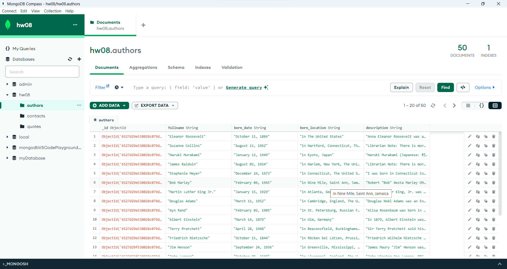
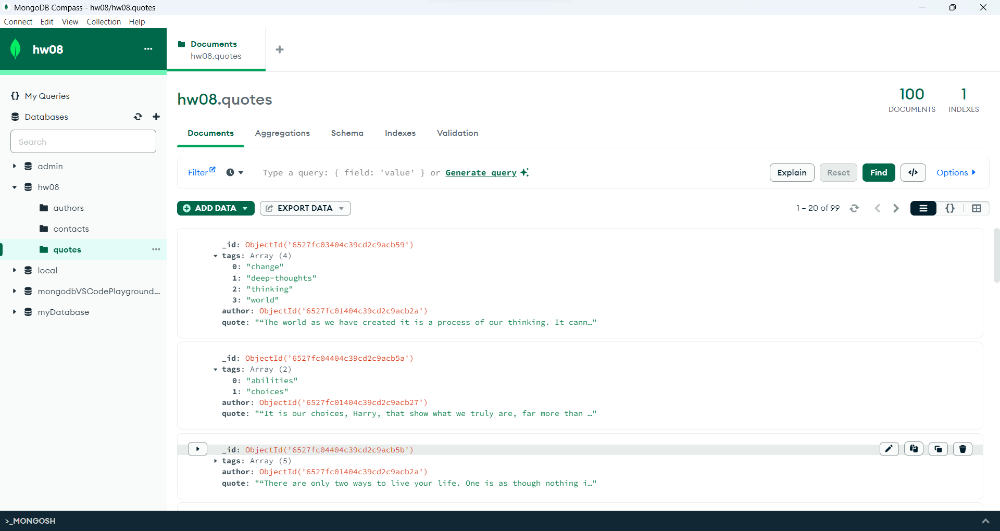
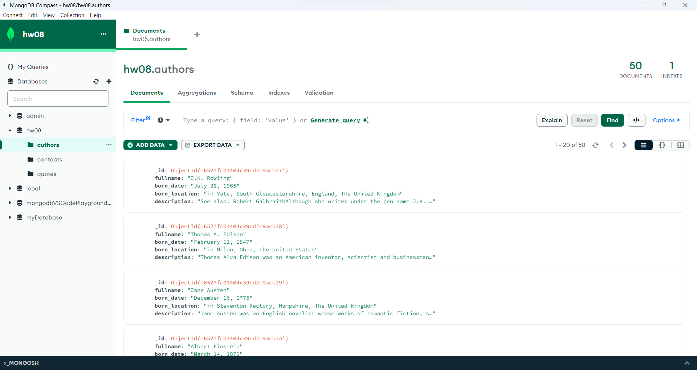
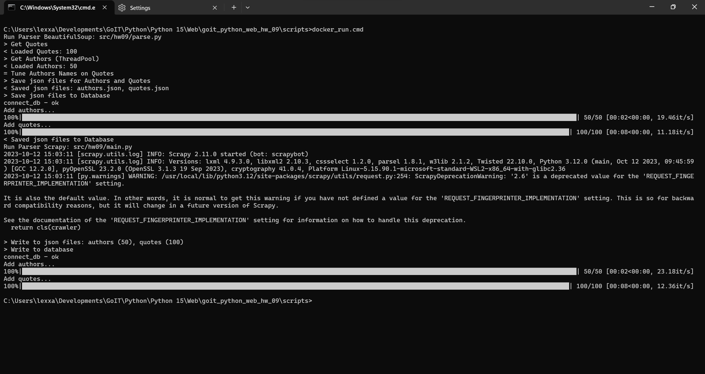

# goit_python_web_hw_09
GoIT, Python WEB, Homework number 09. Web-scraping. BeautifulSoup. NoSQL. MongoDB. Scrapy, ThreadPool. Docker.

## Домашнє завдання #9

Виберіть бібліотеку BeautifulSoup або фреймворк Scrapy. 

Ви повинні виконати скрапінг сайту http://quotes.toscrape.com. Ваша мета отримати два файли: qoutes.json, куди помістіть всю інформацію про цитати, з усіх сторінок сайту та authors.json, де буде знаходитись інформація про авторів зазначених цитат. 

Структура файлів json повинна повністю збігатися з попереднього домашнього завдання. Виконайте раніше написані скрипти для завантаження json файлів у хмарну базу даних для отриманих файлів. 

Попередня домашня робота повинна коректно працювати з новою отриманою базою даних.

### Додаткове завдання.
Використовуйте для скрапінгу фреймворк Scrapy. 

Запуск краулера повинен бути виконаний у вигляді єдиного скрипта main.py.


## Виконання
### 1. BeautifulSoup, ThreadPool, MongoDB
python src/hw09/parse.py
```
> Get Quotes
< Loaded Quotes: 100
> Get Authors (ThreadPool)
< Loaded Authors: 50
= Tune Authors Names on Quotes
> Save json files for Authors and Quotes
< Saved json files: authors.json, quotes.json
> Save json files to Database
connect_db - ok
Add authors...
100%|████████████████████████████████████████████████████████████████████████████████████████████| 50/50 [00:02<00:00, 18.84it/s]
Add quotes...
100%|██████████████████████████████████████████████████████████████████████████████████████████| 100/100 [00:08<00:00, 12.14it/s]
< Saved json files to Database
```
#### Databses 01




### 2. Scrapy, MongoDB
python.exe "src/hw09/main.py"
```
2023-10-12 17:00:26 [scrapy.utils.log] INFO: Scrapy 2.11.0 started (bot: scrapybot)
2023-10-12 17:00:26 [scrapy.utils.log] INFO: Versions: lxml 4.9.3.0, libxml2 2.10.3, cssselect 1.2.0, parsel 1.8.1, w3lib 2.1.2, Twisted 22.10.0, Python 3.12.0 (tags/v3.12.0:0fb18b0, Oct  2 2023, 13:03:39) [MSC v.1935 64 bit (AMD64)], pyOpenSSL 23.2.0 (OpenSSL 3.1.3 19 Sep 2023), cryptography 41.0.4, Platform Windows-11-10.0.22621-SP0
2023-10-12 17:00:26 [py.warnings] WARNING: virtualenvs\goit-python-web-hw-09-yWBMqls4-py3.12\Lib\site-packages\scrapy\utils\request.py:254: ScrapyDeprecationWarning: '2.6' is a deprecated value for the 'REQUEST_FINGERPRINTER_IMPLEMENTATION' setting.

It is also the default value. In other words, it is normal to get this warning if you have not defined a value for the 'REQUEST_FINGERPRINTER_IMPLEMENTATION' setting. This is so for backward compatibility reasons, but it will change in a future version of Scrapy.

See the documentation of the 'REQUEST_FINGERPRINTER_IMPLEMENTATION' setting for information on how to handle this deprecation.    
  return cls(crawler)

> Write to json files: authors (50), quotes (100)
> Write to database
connect_db - ok
Add authors...
100%|████████████████████████████████████████████████████████████████████████████████████████████| 50/50 [00:02<00:00, 20.78it/s]
Add quotes...
100%|██████████████████████████████████████████████████████████████████████████████████████████| 100/100 [00:08<00:00, 11.16it/s]

```
#### Databses 02



### 3. Docker
- build image: scripts\docker_build_image.cmd
- run : scripts\docker_run.cmd




